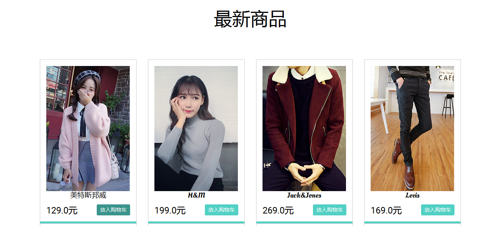
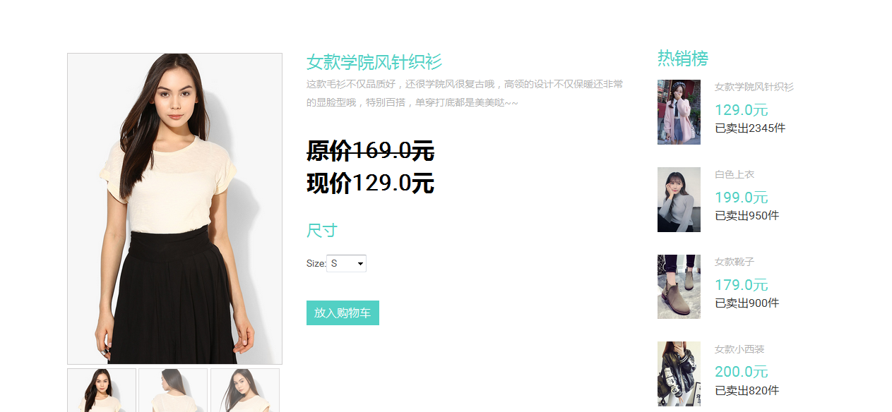
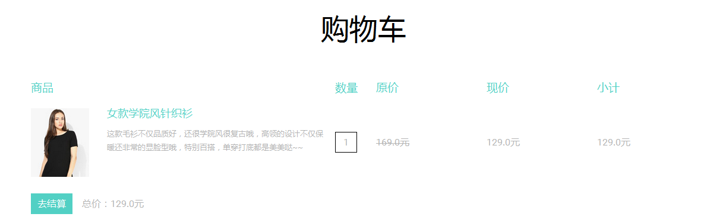
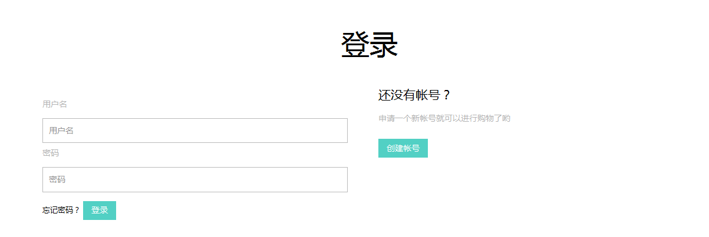

# storeproject
Django实现商城网站

##开发环境
Python3.4，Django1.8.4，Mysql5.6

##实现功能点
1. 商品分类
2. 最新商品列表
3. 品牌列表
4. 标签列表
5. 商品详情
6. 注册
7. 登录
8. 注销
9. 查看购物车
10. 添加购物车
11. 清空购物车
12. 筛选打折商品
13. 分页
14. 日志器
15. 后台Admin管理端

##用到的主要技术
1. Django ORM常用查询，排序，分页
2. Django session缓存购物车信息
3. Html CSS JS Jquery Bootstrap

##主要运行效果

###商品列表

###商品详情

###购物车

###登录

